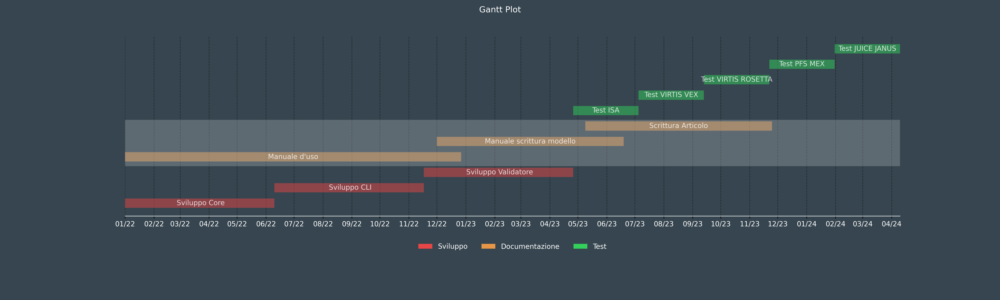

# PyGantt
Build simple Gantt diagram from CSV file

Based on Thiago Carvalho's [article](https://towardsdatascience.com/gantt-charts-with-pythons-matplotlib-395b7af72d72) 
## Usage

PyGantt [-h] [-i FILE] [-o FILE] [-t TITLE] [-x NUM] [-s] [-d]

### Optional arguments:
Option| Description
---|---
**-h**, **--help**|    show this help message and exit
**-i**, **--input** *FILE*|    The CSV input file. The default is gantt.csv
**-o**, **--output** *FILE*|   The PNG output file. The default is gantt.png
**-t**, **--title** *TITLE*|   Title of the plot
**-x**, **--xticks** *NUM*|  Set the x Thicks frequency to NUM. The default is every month (1)
**-s**, **--show**| Display the plot. No output will be saved
**-d**, **--display**|         Display the input data and the computed one and exit

### Example
Create a Gantt diamgram using the data in the file *time.csv* and save it in the file *doc/example.png*
```bash
$ ./PyGantt.py -i time.csv -o doc/example.png
```
The result is:

